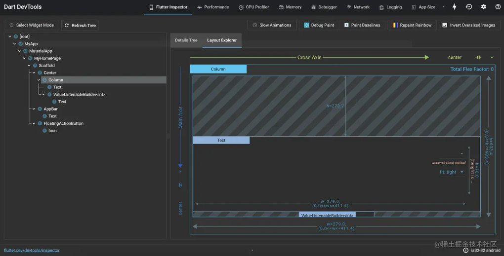
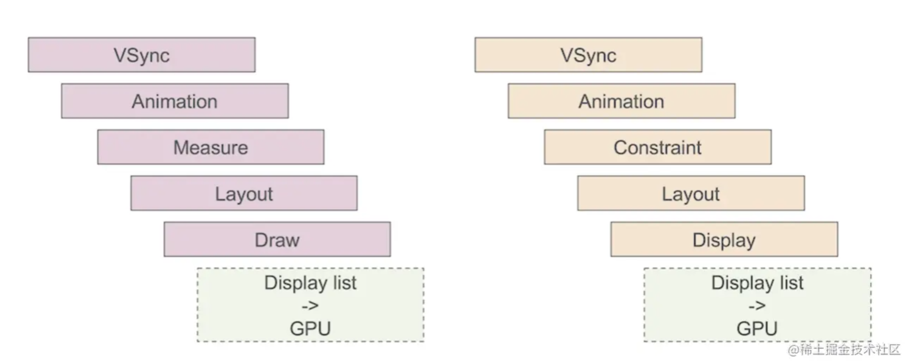
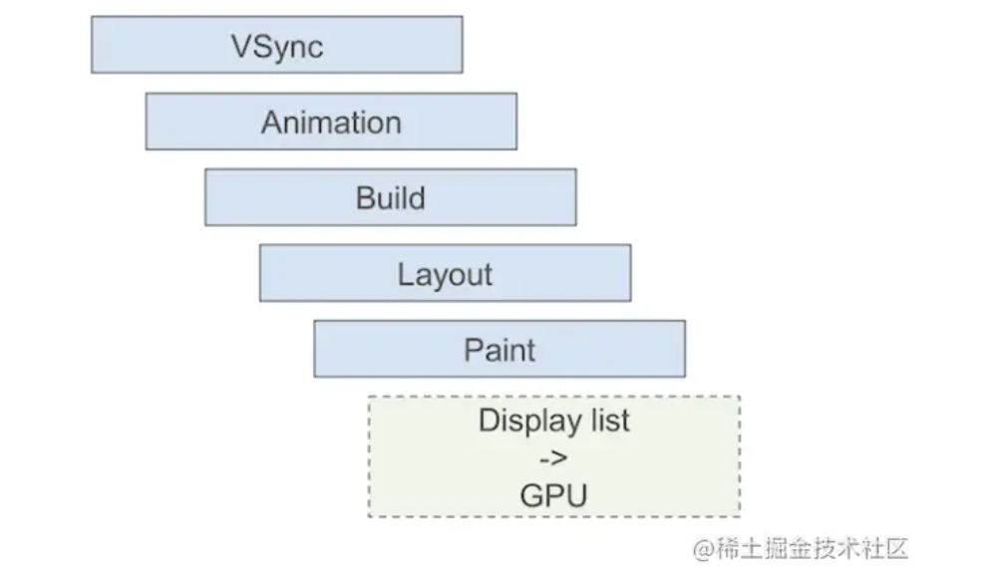
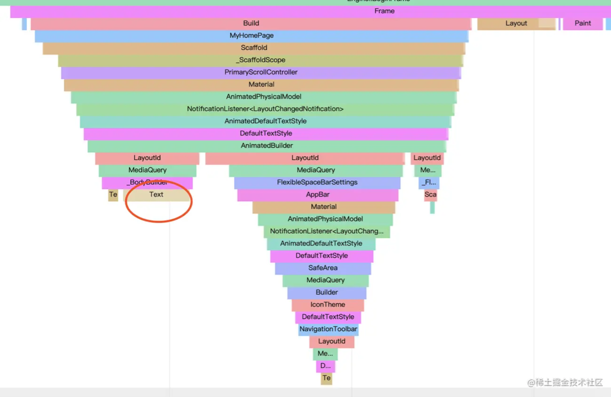
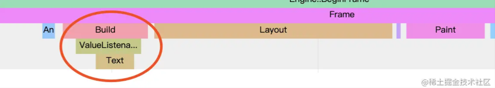
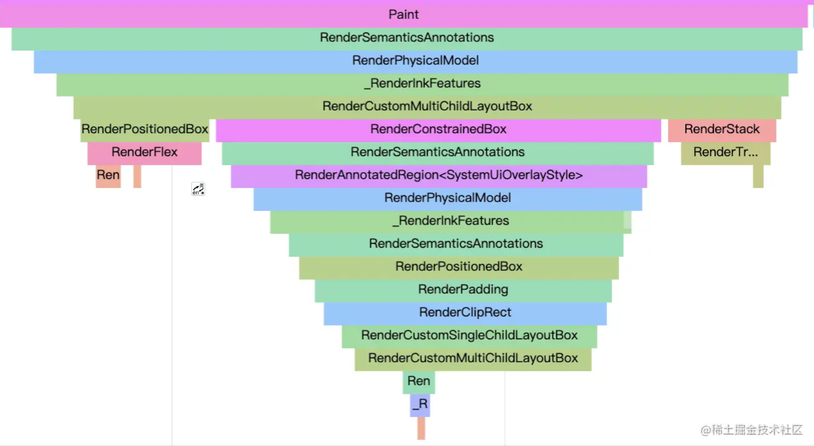
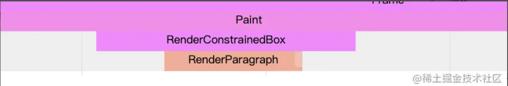
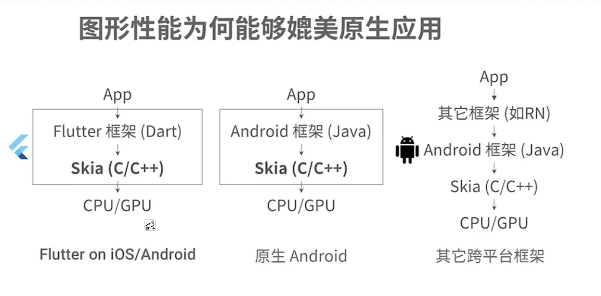
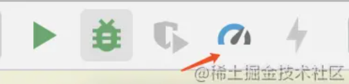
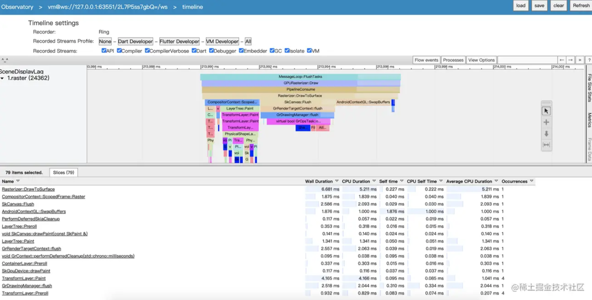

# Flutter 编译模式

Flutter 支持 3 种运行模式，包括 Debug、Release 和 Profile，在编译时，这三种模式是完全独立的；

1. Debug 模式对应 Dart 的 JIT 模式，可以在真机和模拟器上同时运行。该模式会打开所有的断言（assert），以及所有的调试信息、服务扩展和调试辅助（比如 Observatory）。此外，该模式为快速开发和运行做了优化，支持亚秒级有状态的 Hot reload（热重载），但并没有优化代码执行速度、二进制包大小和部署。flutter run --debug 命令，就是以这种模式运行的。
2. Release 模式对应 Dart 的 AOT 模式，只能在真机上运行，不能在模拟器上运行，其编译目标为最终的线上发布，给最终的用户使用。该模式会关闭所有的断言，以及尽可能多的调试信息、服务扩展和调试辅助。此外，该模式优化了应用快速启动、代码快速执行，以及二级制包大小，因此编译时间较长。flutter run --release 命令，就是以这种模式运行的。
3. Profile 模式，基本与 Release 模式一致，只是多了对 Profile 模式的服务扩展的支持，包括支持跟踪，以及一些为了最低限度支持所需要的依赖（比如，可以连接 Observatory 到进程）。该模式用于分析真实设备实际运行性能。flutter run --profile 命令，就是以这种模式运行的。

# Flutter 开发调试工具

输出日志
print() 、debugPrint() 这两个函数打印日志；

## 断点调试

使用的 AndroidStudio，调试跟开发原生一样

## Debug 模式断言

我们在断言里传入了一个始终返回 true 的匿名函数执行结果，这个匿名函数的函数体只会在 Debug 模式下生效，Flutter 源码中很多地方使用这种方式在 Debug 模式下校验；

```
 assert(() {
     /// todo
    return true;
  }());

```

## 布局调试

1. debugPaintSizeEnabled = true; 能够以辅助线的方式，清晰展示每个控件元素的布局边界，可以根据辅助线快速找出布局出问题的地方；
2. Open DevTools 获取到 Widget 的可视化信息（比如布局信息、渲染信息)等
<p align="center">
    
</p>

# Flutter 性能分析

在 Flutter 中，性能问题可以分为 GPU 线程问题和 UI 线程（CPU）问题两类

UI 渲染时间都去哪里了

<p align="center">
    
</p>

<p align="center">
    
</p>

上面两个图上面的是原生 Adnroid、ios，下面是 Flutter UI 渲染过程，可以看到基本上都是差不多的，UI 绘制耗时主要发生在测量、布局、绘制阶段；

## Flutter build 、 layout 、 paint 性能阶段

下面通过一个 demo 例子分析 Flutter build 、 layout 、 paint 阶段，界面是默认创建 Fulutter 项目的例子，改成每过一秒自动刷新 count++ 、刷新界面，(去除 FloatingActionButton 点击水波纹动画的影响)；

```dart
void main() {
  debugProfileBuildsEnabled = true;
  //debugPrintLayouts = true;
  // debugPaintLayerBordersEnabled = true;
  // debugRepaintRainbowEnabled = true;
  // debugProfilePaintsEnabled = true;
  runApp(MyApp());
}

class MyApp extends StatelessWidget {
  @override
  Widget build(BuildContext context) {
    return MaterialApp(
      title: 'Flutter Demo',
      theme: ThemeData(
        primarySwatch: Colors.blue,
        visualDensity: VisualDensity.adaptivePlatformDensity,
      ),
      home: MyHomePage(title: 'Flutter Demo Home Page'),
    );
  }
}

class MyHomePage extends StatefulWidget {
  MyHomePage({Key key, this.title}) : super(key: key);
  final String title;

  @override
  _MyHomePageState createState() => _MyHomePageState();
}

class _MyHomePageState extends State<MyHomePage> {
  int _counter = 0;

  @override
  void initState() {
    super.initState();
    Timer.periodic(Duration(seconds: 1), (timer) {
      if(mounted)
      setState(() {
        _counter++;
      });
    });
  }

  @override
 void dispose() {
    if (_timer != null) {
       _timer.cancel();
     }
    super.dispose();
 }

  @override
  Widget build(BuildContext context) {
    return Scaffold(
      appBar: AppBar(
        title: Text(widget.title),
      ),
      body: Center(
        child: Column(
          mainAxisAlignment: MainAxisAlignment.center,
          children: <Widget>[
            Text(
              'You have pushed the button this many times:',
            ),
            Text(
              '$_counter',
              style: Theme.of(context).textTheme.headline4,
            )
          ],
        ),
      ),
    );
  }
}

```

### Build 阶段

通过 Flutter 提供的可视化工具 Observatory timeline Build 阶段查看

<p align="center">
    
</p>

- 可以看到 build 阶段相比于 layout、paint 阶段耗时要长的；
- 每一帧刷新会把 MyHomePage 所有的 widget 重新构建了一遍，因为 Flutter 把 widget 设计成不可变的；

分析：我们只是改变了红色圈里的 Text widget 的文本，但是 build 创建了 MyHomePage 的所有 widget;这是最简单的界面，如果界面稍微复杂耗时更多；这也是我们平时写代码容易犯错的，因为我们是在\_MyHomePageState 调用的 setState()，Flutter 就会把 MyHomePage 对应的 StatefulElement 标脏，所以刷新整个 MyHomePage；
仔细分析下界面刷新基本上就有三种情况：

- setState() 刷新；
- InheritedWidget 依赖改变刷新
- Hot Reload 热重载(只用到开发者开发阶段);

解决问题就是 局部刷新，也就是控制 Build 的粒度，只构建刷新的部分；实现局部刷新可以使用 以通过 provider 、GetX、flutter_bloc 等状态管理库实现

provider 封装 InheritedWidget

上面是在 pub 上相对活跃的状态管理的库；但是如果一个界面只是更改一下文本引入使用库，相对较重；

- 我们也可以通过提取 widget 组件抽离，例如上面的例子，可以将发生改变的 Text 单独提取到 StatefulWidget 中;
- Flutter 框架内部也提供专门用于局部组件的刷新，ValueListenableBuilder,其实 ValueListenableBuilder 的本质也是组件抽离；

对上面的例子使用 ValueListenableBuilder 优化

```dart
void main() {
  debugProfileBuildsEnabled = true;
  //debugPrintLayouts = true;
  // debugPaintLayerBordersEnabled = true;
  // debugRepaintRainbowEnabled = true;
  // debugProfilePaintsEnabled = true;
  runApp(MyApp());
}

class MyApp extends StatelessWidget {
  @override
  Widget build(BuildContext context) {
    return MaterialApp(
      title: 'Flutter Demo',
      theme: ThemeData(
        primarySwatch: Colors.blue,
        visualDensity: VisualDensity.adaptivePlatformDensity,
      ),
      home: MyHomePage(title: 'Flutter Demo Home Page'),
    );
  }
}

class MyHomePage extends StatefulWidget {
  MyHomePage({Key key, this.title}) : super(key: key);
  final String title;

  @override
  _MyHomePageState createState() => _MyHomePageState();
}

class _MyHomePageState extends State<MyHomePage> {
  final ValueNotifier<int> _counter = ValueNotifier<int>(0);
  Timer _timer;

  @override
  void initState() {
    super.initState();
    _timer = Timer.periodic(Duration(seconds: 1), (timer) {
      if (mounted) _counter.value++;
    });
  }

  @override
  void dispose() {
    if (_timer != null) {
      _timer.cancel();
    }
    super.dispose();
  }

  @override
  Widget build(BuildContext context) {
    return Scaffold(
      appBar: AppBar(
        title: Text(widget.title),
      ),
      body: Center(
        child: Column(
          mainAxisAlignment: MainAxisAlignment.center,
          children: <Widget>[
            Text(
              'You have pushed the button this many times:',
            ),
            ValueListenableBuilder(
              valueListenable: _counter,
              builder: (ctx, value, child) {
                return Text(
                  '$value',
                  style: Theme.of(context).textTheme.headline4,
                );
              },
            ),
          ],
        ),
      ),
    );
  }
}

```

再看下 Observatory timeline Build 阶段

<p align="center">
    
</p>

对比前后可以看到 build，使用 ValueListenableBuilder 更改后，build 只是从 ValueListenableBuilder 开始刷新创建的
Flutter 也提供 ValueListenableBuilder 类似局部刷新的 Widget

- FutureBuilder
- StreamBuilder
- AnimatedBuilder(里面有一个 child 属性，我们设置可以跟动画无关的 widget,复用不用每一帧都创建，要知道动画每秒 60hz 的话，每秒要创建 60 个没有必要的 widget 的对象)

### layout 阶段

在 Observatory timeline 我没有找到 layout 阶段打印分析？？？

debugPrintLayouts = true;可以在控制台输出需要重新布局的 RenderObject;
layout 阶段主要是当有一个节点被标脏，有多少其他节点跟着一起重新布局；会涉及到布局边界的优化；

布局边界这块开发者基本上不会犯错误，因为这块 Flutter 框架帮我们做了优化；自动在合适的地方设置布局边界，如果在自定义 widget 的时候，自定义 RenderObject,可以考虑 widget 是否可以触发布局边界，提高性能的优化；

触发布局边界的条件

```dart
 void layout(Constraints constraints, { bool parentUsesSize = false }) {
   RenderObject relayoutBoundary;
   if (!parentUsesSize || sizedByParent || constraints.isTight || parent is!            RenderObject) {
        relayoutBoundary = this;
    } else {
        relayoutBoundary = (parent as RenderObject)._relayoutBoundary;
    }

  }
```

### paint 阶段

Paint 阶段是当有一个节点被标脏，有多少其他节点跟着一起重新绘制；就会涉及到图层概念，绘制边界；

Flutter 会让应用的分界线形成自己图层就比如 SingleChildScrollView 屏幕外 跟屏幕内在不同的图层里；

上面的例子我们打开 debugProfilePaintsEnabled = true;查看 timeline

<p align="center">
    
</p>

可以看到 Text 文本更新涉及到很多节点跟着一起被标脏了，因为他们在一个图层里面；虽然 Flutter 也做了 diff 优化，因为 RenderObject 是一个长的生命周期对象，在 updateRenderObject()setter 中会做优化，就比如下面是 RenderDecoratedBox 的 setter decoration 方法；如果前后没有变化就直接返回了，没有去重绘；

```dart
set decoration(Decoration value) {
  assert(value != null);
  if (value == _decoration)
    return;
  _painter?.dispose();
  _painter = null;
  _decoration = value;
  markNeedsPaint();
}
```

如果一个界面很复杂，有一块区域一直在刷新，比如一块区域一直在做动画，而且不影响其他的部分的话，就算 Flutter 会对 Paint 阶段做 diff 优化，会涉及到大量的遍历；也是会增加 paint 的时间；flutter 提供了 RepaintBoundary 自己会 c 闯将一个单独的图层；隔离起来；
使用 RepaintBoundary 将更改 widget 的包裹起来
可以看到更新只在这个图层的更新

<p align="center">
    
</p>

## GPU 渲染性能分析

<p align="center">
    
</p>

可以看到 Flutter 性能为什么能媲美原生或者超越原生的原因；

原生 app 绘制的流程，Android 框架 java 代码--->> skia(c/c++)绘图引擎--->>cpu/gpu 指令--->>设备显示绘图；

Flutter 框架 dart 代码完全取代了原生 java 代码，而且 skia 作为 Flutter sdk 的一部分；Flutter sdk 升级很快也很方便；skia 性能的优化很快体现到 Flutter 性能中；
分析性能要使用 profile 模式去验证，用真机不要用模拟机；

```
flutter run --profile
```

<p align="center">
    
</p>

Flutter 应用 skia api 的调用
flutter run --profile --trace-skia

<p align="center">
    
</p>

可以看到每个帧的消耗时间，每个函数消耗时间及调用次数；

如果遇到性能问题，UI 渲染优化后，还是会卡顿，我们可以针对分析调用 skia api 函数消耗的时间及次数做优化；

### 捕捉每一条 SKPicture 绘制指令

```
flutter screenshot --type=skia --observatory-uri="生成的本地uri";
```

生成一个 skp 格式的文件在项目根目录；然后上传文件到 debugger.skia.org/ （需翻墙）进行分析。可以播放暂停逐条的绘图指令逐一分析；

#### skp 文件观察

1.  运行项目

    ```
    flutter --profile --trace-skia
    ```

2.  性能调试 在 Android iOS 中 配合 --profile --trace-skia 一起使用
    url 在 The Flutter DevTools debugger and profiler on Redmi K30 Pro is available at: http://127.0.0.1:4144/gmgFxLmetgE=/ 会生成 skp 文件，然后上传到 debugger.skia.org/

        ```
        flutter screenshot --type=skia --observatory-url=url
        ```

### 耗时的 skia 函数

saveLayer、ClipPath、Opacity、ShaderMask、ColorFilter、PhysicalModel、BackdropFilter 等使用，项目中最好不要用很耗性能的 widget 或者函数；
比如如果使用 ClipPath；Flutter 文档也提示了是一个昂贵耗时的操作，可以选择 ClipRRect、ClipRRect 代替等

```
/// A widget that clips its child using a path.
///
/// Calls a callback on a delegate whenever the widget is to be
/// painted. The callback returns a path and the widget prevents the
/// child from painting outside the path.
///
/// Clipping to a path is expensive. Certain shapes have more
/// optimized widgets:
///
///  * To clip to a rectangle, consider [ClipRRect].
///  * To clip to an oval or circle, consider [ClipOval].
///  * To clip to a rounded rectangle, consider [ClipRRect].
///
/// To clip to a particular [ShapeBorder], consider using either the
/// [ClipPath.shape] static method or the [ShapeBorderClipper] custom clipper
/// class.
```
